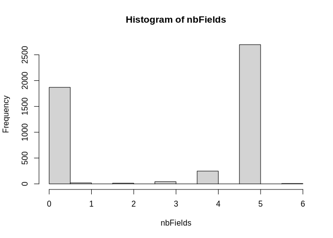
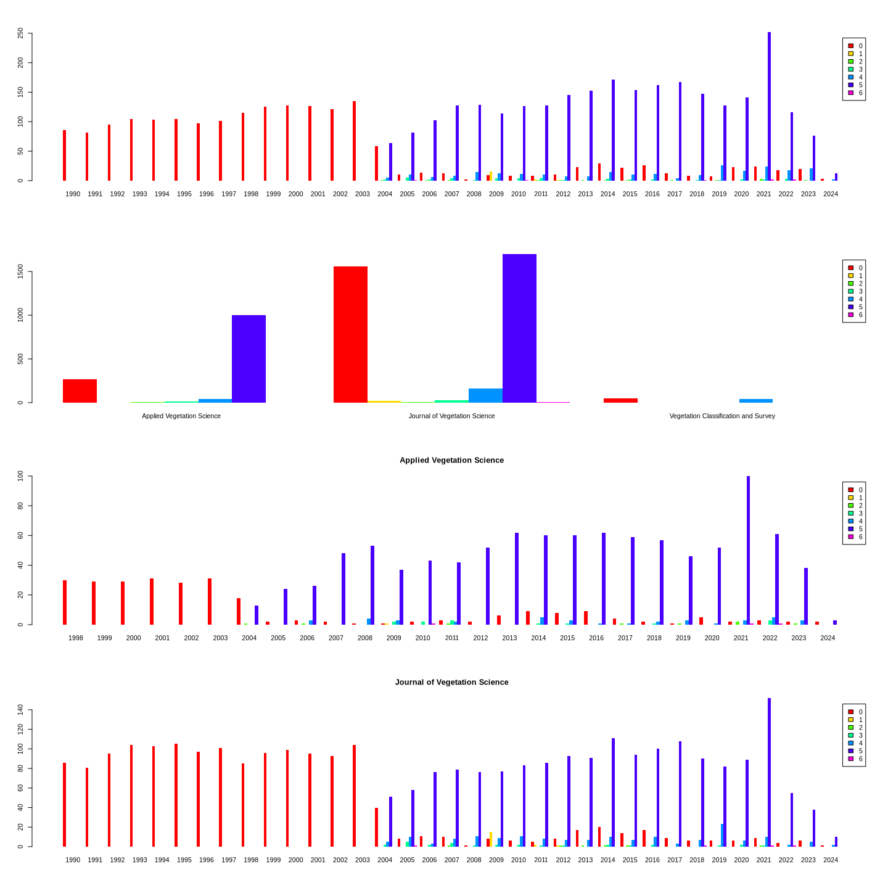

Managing the abstract data from the scopus CSV file
================
Marius Bottin
2024-03-11

- [1 Reading the csv file](#1-reading-the-csv-file)
- [2 Suppressing last sentence when not part of the
  text](#2-suppressing-last-sentence-when-not-part-of-the-text)
- [3 Suppressing the word abstract at the
  beginning](#3-suppressing-the-word-abstract-at-the-beginning)
- [4 Searching fields](#4-searching-fields)
- [5 formatting and exporting](#5-formatting-and-exporting)

# 1 Reading the csv file

``` r
fileTot<-"../../Data/SCOPUS/scopus.csv"
datab <- read.csv(fileTot, h = T, row.names = NULL,sep=",")
```

# 2 Suppressing last sentence when not part of the text

``` r
sort(table(sub("^.*\\. (.+).? ?$","\\1",datab$Abstract,perl=T)),decreasing = T)[1:10]
```

    ## 
    ##                                    © IAVS; Opulus Press. 
    ##                                                      377 
    ## © 2012 International Association for Vegetation Science. 
    ##                                                      214 
    ## © 2011 International Association for Vegetation Science. 
    ##                                                      184 
    ## © 2014 International Association for Vegetation Science. 
    ##                                                      172 
    ## © 2013 International Association for Vegetation Science. 
    ##                                                      168 
    ##  © 2016 International Association for Vegetation Science 
    ##                                                      167 
    ##  © 2020 International Association for Vegetation Science 
    ##                                                      162 
    ##  © 2019 International Association for Vegetation Science 
    ##                                                      161 
    ## © 2009 International Association for Vegetation Science. 
    ##                                                      160 
    ##                                  [No abstract available] 
    ##                                                      158

``` r
# regexCopyright<-"\\.[[:space:]]?(©)|(Copyright).*$"
# #datab$Abstract[!grepl(regexCopyright,datab$Abstract,perl=T)]
# modifAbstract<-sub(regexCopyright,"",datab$Abstract,perl=T)
# hist(nchar(modifAbstract)/nchar(datab$Abstract),nclass=1000)
# data.frame(modif=modifAbstract[(nchar(modifAbstract)/nchar(datab$Abstract))<0.95],origin=datab$Abstract[(nchar(modifAbstract)/nchar(datab$Abstract))<0.95])
# data.frame(modif=modifAbstract[(nchar(modifAbstract)/nchar(datab$Abstract))>0.95],origin=datab$Abstract[(nchar(modifAbstract)/nchar(datab$Abstract))>0.95])[1:10,]
```

``` r
regexCopyright2<-"\\. ?©"
findCopy2<-gregexpr(regexCopyright2,datab$Abstract)
stopifnot(sapply(findCopy2,length)==1)
w_copy2<-unlist(findCopy2)
modif2Abstract<-datab$Abstract
for(i in 1:length(datab$Abstract))
{
  if(w_copy2[i]==-1||w_copy2[i]/nchar(datab$Abstract[i])<.85){next}
  modif2Abstract[i]<-substr(modif2Abstract[i],1,w_copy2[i])
}
randomAbstractN<-sample(grep(regexCopyright2,datab$Abstract),5)
data.frame(origin=datab$Abstract[randomAbstractN],modif=modif2Abstract[randomAbstractN])
```

<div class="kable-table">

| origin                                                                                                                                                                                                                                                                                                                                                                                                                                                                                                                                                                                                                                                                                                                                                                                                                                                                                                                                                                                                                                                                                                                                                                                                                                                                                                                                                                                                                                                                                                                                                                                                                                                                                                                                                                                                                                                                                                                                                                                                                                                                                                                                                                                                                                                                                                                                                                 | modif                                                                                                                                                                                                                                                                                                                                                                                                                                                                                                                                                                                                                                                                                                                                                                                                                                                                                                                                                                                                                                                                                                                                                                                                                                                                                                                                                                                                                                                                                                                                                                                                                                                                                                                                                                                                                                                                                                                                                                                                                                                                                                                                                                                                                                                                                                         |
|:-----------------------------------------------------------------------------------------------------------------------------------------------------------------------------------------------------------------------------------------------------------------------------------------------------------------------------------------------------------------------------------------------------------------------------------------------------------------------------------------------------------------------------------------------------------------------------------------------------------------------------------------------------------------------------------------------------------------------------------------------------------------------------------------------------------------------------------------------------------------------------------------------------------------------------------------------------------------------------------------------------------------------------------------------------------------------------------------------------------------------------------------------------------------------------------------------------------------------------------------------------------------------------------------------------------------------------------------------------------------------------------------------------------------------------------------------------------------------------------------------------------------------------------------------------------------------------------------------------------------------------------------------------------------------------------------------------------------------------------------------------------------------------------------------------------------------------------------------------------------------------------------------------------------------------------------------------------------------------------------------------------------------------------------------------------------------------------------------------------------------------------------------------------------------------------------------------------------------------------------------------------------------------------------------------------------------------------------------------------------------|:--------------------------------------------------------------------------------------------------------------------------------------------------------------------------------------------------------------------------------------------------------------------------------------------------------------------------------------------------------------------------------------------------------------------------------------------------------------------------------------------------------------------------------------------------------------------------------------------------------------------------------------------------------------------------------------------------------------------------------------------------------------------------------------------------------------------------------------------------------------------------------------------------------------------------------------------------------------------------------------------------------------------------------------------------------------------------------------------------------------------------------------------------------------------------------------------------------------------------------------------------------------------------------------------------------------------------------------------------------------------------------------------------------------------------------------------------------------------------------------------------------------------------------------------------------------------------------------------------------------------------------------------------------------------------------------------------------------------------------------------------------------------------------------------------------------------------------------------------------------------------------------------------------------------------------------------------------------------------------------------------------------------------------------------------------------------------------------------------------------------------------------------------------------------------------------------------------------------------------------------------------------------------------------------------------------|
| Questions: What is the impact on non-target species of restoration methods to establish Calluna vulgaris on grassdominated moorlands? Location: A Nardus äfrfc/a-dominated moorland in Wales and a Molinia caeru/ea-dominated moorland in Northern England, UK. Methods: Two replicated experiments were established on grass-dominated moorlands. The treatments comprised disturbance (rotavation and trampling by animals), addition of Calluna seed, and three different grazing regimes, together with a no grazing control. Results: The creation of bare ground and addition of seed increased the establishment of the desired dominant shrub, Calluna vulgaris. In the Nardus sward, rotavation and trampling were equally successful in establishing Calluna, but rotavation was more successful in the Molinia sward. Rotavation inhibited the growth of competitive grass species better than trampling. However, the disturbance techniques were detrimental to other components of the plant community, causing a decline in the cover of desirable species such as Vaccinium myrtillus and other dwarf shrub species and a small increase in the occurrence of undesirable species such as Juncus effusus. Grazing also controlled competitive grass species: Festuca ovina decreased in cover at a grazing intensity of 1.5 ewes/ha; Molinia caerulea and Agrostis spp. declined when cattle were included in the grazing regime, but increased in cover when ungrazed or when grazed at 1.5 ewes/ha. Conclusions: When restoration concentrates on the establishment of one or a few species, it is important to monitor how the techniques used affect the rest of the plant community - particularly with regard to losses of desirable species or increases in undesirable species. © 2009 International Association of vegetation Science.                                                                                                                                                                                                                                                                                                                                                                                                                                                                                                        | Questions: What is the impact on non-target species of restoration methods to establish Calluna vulgaris on grassdominated moorlands? Location: A Nardus äfrfc/a-dominated moorland in Wales and a Molinia caeru/ea-dominated moorland in Northern England, UK. Methods: Two replicated experiments were established on grass-dominated moorlands. The treatments comprised disturbance (rotavation and trampling by animals), addition of Calluna seed, and three different grazing regimes, together with a no grazing control. Results: The creation of bare ground and addition of seed increased the establishment of the desired dominant shrub, Calluna vulgaris. In the Nardus sward, rotavation and trampling were equally successful in establishing Calluna, but rotavation was more successful in the Molinia sward. Rotavation inhibited the growth of competitive grass species better than trampling. However, the disturbance techniques were detrimental to other components of the plant community, causing a decline in the cover of desirable species such as Vaccinium myrtillus and other dwarf shrub species and a small increase in the occurrence of undesirable species such as Juncus effusus. Grazing also controlled competitive grass species: Festuca ovina decreased in cover at a grazing intensity of 1.5 ewes/ha; Molinia caerulea and Agrostis spp. declined when cattle were included in the grazing regime, but increased in cover when ungrazed or when grazed at 1.5 ewes/ha. Conclusions: When restoration concentrates on the establishment of one or a few species, it is important to monitor how the techniques used affect the rest of the plant community - particularly with regard to losses of desirable species or increases in undesirable species.                                                                                                                                                                                                                                                                                                                                                                                                                                                                                                       |
| Question: Afforestation is a controversial method for restoring semi-arid sandy ecosystems to control desertification. We studied how native elm trees (Ulmus pumila L.) interact with grasses in the semi-arid sandy ecosystem of the Otindag, and how the trees should be arranged to promote ecological restoration. Location: Otindag Sandy Land, Inner Mongolia, northern China. Methods: Using 40 adult elms, we investigated and compared root depths of the native trees with those of neighbouring grasses. The shallowest elm roots and the deepest grass roots were analysed. Using four singleton elms, we also examined how soil moisture in the different soil layers (0-10, 10-20, 20-30 and 30-40 cm) and grass biomass density changed with distance from the corresponding tree trunks in four directions within 19 m. Results: On average, the shallowest elm roots were 17.6 cm deep at 1 m from the elm trunks, and 24.5 cm at 3 m from the elm trunks, whereas the deepest grass roots were 14 cm deep at 1 m from the trunks, and 16.3 cm deep at 3 m from the trunks. The moisture content in the 0-20 cm layers decreased with distance from 1 to 19 m from the singleton elms, but increased along the same distance gradient in the 20-40 cm layers. Grass biomass density decreased along the distance gradient, and a logistic model fits this tendency well, which indicates that the grass biomass density levels off at distances of \>ca. 9 m. Conclusions: Given the vertical divergence of roots and the horizontal pattern of soil moisture, the adult native trees do not compete for much moisture with grasses. The adult native trees have the potential to facilitate the growth and biomass accumulation of nearby grasses. In the semi-arid sandy ecosystem of the Otindag, native elms can be planted for ecological restoration at intervals of up to 18 m. © 2013 International Association for Vegetation Science.                                                                                                                                                                                                                                                                                                                                                                                                      | Question: Afforestation is a controversial method for restoring semi-arid sandy ecosystems to control desertification. We studied how native elm trees (Ulmus pumila L.) interact with grasses in the semi-arid sandy ecosystem of the Otindag, and how the trees should be arranged to promote ecological restoration. Location: Otindag Sandy Land, Inner Mongolia, northern China. Methods: Using 40 adult elms, we investigated and compared root depths of the native trees with those of neighbouring grasses. The shallowest elm roots and the deepest grass roots were analysed. Using four singleton elms, we also examined how soil moisture in the different soil layers (0-10, 10-20, 20-30 and 30-40 cm) and grass biomass density changed with distance from the corresponding tree trunks in four directions within 19 m. Results: On average, the shallowest elm roots were 17.6 cm deep at 1 m from the elm trunks, and 24.5 cm at 3 m from the elm trunks, whereas the deepest grass roots were 14 cm deep at 1 m from the trunks, and 16.3 cm deep at 3 m from the trunks. The moisture content in the 0-20 cm layers decreased with distance from 1 to 19 m from the singleton elms, but increased along the same distance gradient in the 20-40 cm layers. Grass biomass density decreased along the distance gradient, and a logistic model fits this tendency well, which indicates that the grass biomass density levels off at distances of \>ca. 9 m. Conclusions: Given the vertical divergence of roots and the horizontal pattern of soil moisture, the adult native trees do not compete for much moisture with grasses. The adult native trees have the potential to facilitate the growth and biomass accumulation of nearby grasses. In the semi-arid sandy ecosystem of the Otindag, native elms can be planted for ecological restoration at intervals of up to 18 m.                                                                                                                                                                                                                                                                                                                                                                                                      |
| Question: Do solid-walled polyethylene tubes and mesh fabric tubes improve the short-term survival of eight Mediterranean tree and shrub species often used in the restoration of arid environments?Location: We conducted two experimental plantations in degraded field sites in the province of Almería (SE Spain), under arid Mediterranean conditions.Methods: One-year-old seedlings of Ceratonia siliqua, Juniperus phoenicea, Olea europaea, Pinus halepensis, Pinus pinaster, Quercus coccifera, Quercus ilex and Tetraclinis articulata were planted either sheltered by one of the above shelter tubes, or by being left unsheltered. Survival was recorded the first growing season after planting, which was a very dry season.Results: Overall, seedling survival ranged from as little as 0% to 24%, and tree shelters consistently enhanced survival in Quercus species only, ranging from 16% in walled shelters to 8% in mesh shelters. Shelters failed to boost survival in the six remaining species.Conclusion: The results of this study suggest that both walled and mesh shelters were mostly ineffective at increasing seedling survival for the Mediterranean species used in this experiment; these species coincide with those used in restoration programs. The use of shelters in restoration programs conducted in arid environments should be reconsidered, while walled shelters might be advisable for Mediterranean Quercus species only. Further research is necessary to develop and assess improved types of shelters for arid environments. © 2010 International Association for Vegetation Science.                                                                                                                                                                                                                                                                                                                                                                                                                                                                                                                                                                                                                                                                                                                            | Question: Do solid-walled polyethylene tubes and mesh fabric tubes improve the short-term survival of eight Mediterranean tree and shrub species often used in the restoration of arid environments?Location: We conducted two experimental plantations in degraded field sites in the province of Almería (SE Spain), under arid Mediterranean conditions.Methods: One-year-old seedlings of Ceratonia siliqua, Juniperus phoenicea, Olea europaea, Pinus halepensis, Pinus pinaster, Quercus coccifera, Quercus ilex and Tetraclinis articulata were planted either sheltered by one of the above shelter tubes, or by being left unsheltered. Survival was recorded the first growing season after planting, which was a very dry season.Results: Overall, seedling survival ranged from as little as 0% to 24%, and tree shelters consistently enhanced survival in Quercus species only, ranging from 16% in walled shelters to 8% in mesh shelters. Shelters failed to boost survival in the six remaining species.Conclusion: The results of this study suggest that both walled and mesh shelters were mostly ineffective at increasing seedling survival for the Mediterranean species used in this experiment; these species coincide with those used in restoration programs. The use of shelters in restoration programs conducted in arid environments should be reconsidered, while walled shelters might be advisable for Mediterranean Quercus species only. Further research is necessary to develop and assess improved types of shelters for arid environments.                                                                                                                                                                                                                                                                                                                                                                                                                                                                                                                                                                                                                                                                                                                            |
| Questions: While positive effects of tree diversity on tree community biomass have often been reported in mature stands, the debate on whether diversity effects may be detectable at the seedling level persists, with opposing outcomes found so far. We still lack a comprehensive evaluation of the biodiversity effects (so-called ‘complementarity’ and ‘selection’ effects), as well as the phenotypic drivers at play, underlying early-community biomass. Even less is known about whether such biodiversity effects may change under water-limited conditions. Location: Seeds from four tree species coexisting in a Mediterranean forest (Spain). Methods: We built experimental tree seedling assemblages with three diversity levels — monocultures, two-species and four-species mixtures — and under two soil moisture conditions. We quantified the extent to which species richness, species identity, community-weighted mean (CWM) and functional dissimilarity (FD) influence complementarity and selection effects. We computed CWM and FD for seven functional traits related to water and light acquisition; and we calculated the complementarity and selection effects from above- and below-ground biomass measures at the community level. Results: Our results showed that complementarity drove the greater biomass in more diverse assemblages at the seedling stage. This pattern was largely favored by a particular species, Quercus faginea, with distinct phenotypic traits (great height, lateral ramification and root biomass with high dry matter content), which induced a positive effect of CWM on community biomass. Moreover, our study showed that the water deficit limited the production of above-ground biomass without interacting with the community’s species richness. Conclusion: Our study provides evidence that positive biodiversity effects on community biomass occur early, at the seedling stage, and it highlights the essential role that certain tree species play from their initial development stages by favoring spatial resource partitioning. Our work motivates future studies to apply integrated approaches in assessing both the community-wide and species-specific effects to understand the biodiversity–biomass relationship. © 2021 International Association for Vegetation Science. | Questions: While positive effects of tree diversity on tree community biomass have often been reported in mature stands, the debate on whether diversity effects may be detectable at the seedling level persists, with opposing outcomes found so far. We still lack a comprehensive evaluation of the biodiversity effects (so-called ‘complementarity’ and ‘selection’ effects), as well as the phenotypic drivers at play, underlying early-community biomass. Even less is known about whether such biodiversity effects may change under water-limited conditions. Location: Seeds from four tree species coexisting in a Mediterranean forest (Spain). Methods: We built experimental tree seedling assemblages with three diversity levels — monocultures, two-species and four-species mixtures — and under two soil moisture conditions. We quantified the extent to which species richness, species identity, community-weighted mean (CWM) and functional dissimilarity (FD) influence complementarity and selection effects. We computed CWM and FD for seven functional traits related to water and light acquisition; and we calculated the complementarity and selection effects from above- and below-ground biomass measures at the community level. Results: Our results showed that complementarity drove the greater biomass in more diverse assemblages at the seedling stage. This pattern was largely favored by a particular species, Quercus faginea, with distinct phenotypic traits (great height, lateral ramification and root biomass with high dry matter content), which induced a positive effect of CWM on community biomass. Moreover, our study showed that the water deficit limited the production of above-ground biomass without interacting with the community’s species richness. Conclusion: Our study provides evidence that positive biodiversity effects on community biomass occur early, at the seedling stage, and it highlights the essential role that certain tree species play from their initial development stages by favoring spatial resource partitioning. Our work motivates future studies to apply integrated approaches in assessing both the community-wide and species-specific effects to understand the biodiversity–biomass relationship. |
| Question: Is the failure of establishment of rare flood-meadow species in habitat restoration primarily due to seed or microsite limitation? How do sown species respond to artificially created gaps and added litter at two neighbouring sites with similar physical conditions but contrasting vegetation matrix (young arable fallow field vs species-poor meadow sward)? Location: Upper Rhine valley, southwestern Germany, 85 m a.s.l. Methods: Seeds of six typical flood-meadow species were sown in four treatment combinations of the factors gap creation and litter addition. Seedling recruitment was monitored for three years. Results: Five of the six species established successfully at both sites largely irrespective of treatments, indicating seed limitation. Only in the small-seeded Arabis nemorensis, which was revealed to be strictly gap-dependent at the meadow site, could an obvious microsite limitation be shown. The non-significance of gap treatments in all other species at the relatively high productive meadow site is probably due to biomass removal by mowing in early summer. Only at the extremes of the seed size spectrum did the results meet predictions of plant ecological theory, such as the strict gap dependence of small-seeded species in closed swards or the positive to neutral response of large-seeded species to litter layers. Conclusions: Species identity was revealed to be the major factor influencing differences in recruitment. Due to the lack of a general trend in the response towards treatments the results support conceptual models that describe the interplay of facilitation and interference as a highly dynamic equilibrium, driven by variable abiotic and biotic marginal conditions. © IAVS; Opulus Press.                                                                                                                                                                                                                                                                                                                                                                                                                                                                                                                                                               | Question: Is the failure of establishment of rare flood-meadow species in habitat restoration primarily due to seed or microsite limitation? How do sown species respond to artificially created gaps and added litter at two neighbouring sites with similar physical conditions but contrasting vegetation matrix (young arable fallow field vs species-poor meadow sward)? Location: Upper Rhine valley, southwestern Germany, 85 m a.s.l. Methods: Seeds of six typical flood-meadow species were sown in four treatment combinations of the factors gap creation and litter addition. Seedling recruitment was monitored for three years. Results: Five of the six species established successfully at both sites largely irrespective of treatments, indicating seed limitation. Only in the small-seeded Arabis nemorensis, which was revealed to be strictly gap-dependent at the meadow site, could an obvious microsite limitation be shown. The non-significance of gap treatments in all other species at the relatively high productive meadow site is probably due to biomass removal by mowing in early summer. Only at the extremes of the seed size spectrum did the results meet predictions of plant ecological theory, such as the strict gap dependence of small-seeded species in closed swards or the positive to neutral response of large-seeded species to litter layers. Conclusions: Species identity was revealed to be the major factor influencing differences in recruitment. Due to the lack of a general trend in the response towards treatments the results support conceptual models that describe the interplay of facilitation and interference as a highly dynamic equilibrium, driven by variable abiotic and biotic marginal conditions.                                                                                                                                                                                                                                                                                                                                                                                                                                                                                                                            |

</div>

``` r
regexCopyright3<-"\\. ?Copyright"
findCopy3<-gregexpr(regexCopyright3,datab$Abstract)
stopifnot(sapply(findCopy3,length)==1)
w_copy3<-unlist(findCopy3)
for(i in 1:length(datab$Abstract))
{
  if(w_copy3[i]==-1||w_copy3[i]/nchar(modif2Abstract[i])<.9){next}
  modif2Abstract[i]<-substr(modif2Abstract[i],1,w_copy3[i])
}
randomAbstractN<-sample(grep("Copyright",datab$Abstract),5)
data.frame(origin=datab$Abstract[randomAbstractN],modif=modif2Abstract[randomAbstractN])
```

<div class="kable-table">

| origin                                                                                                                                                                                                                                                                                                                                                                                                                                                                                                                                                                                                                                                                                                                                                                                                                                                                                                                                                                                                                                                                                                                                                                                                                                                                                                                                                                                                                                                                                                                                                                                                                                                                                                                                                                                                                                                                                                                                                                                                                                                                                                                                                                                                                                                                                                                                                                                                                                                                                                                                                                                                                         | modif                                                                                                                                                                                                                                                                                                                                                                                                                                                                                                                                                                                                                                                                                                                                                                                                                                                                                                                                                                                                                                                                                                                                                                                                                                                                                                                                                                                                                                                                                                                                                                                                                                                                                                                                                                                                                                                                                                                                                                                                                                                                                                                                                                                                                                                                                                                                                                                                                                                                                                                                                                                           |
|:-------------------------------------------------------------------------------------------------------------------------------------------------------------------------------------------------------------------------------------------------------------------------------------------------------------------------------------------------------------------------------------------------------------------------------------------------------------------------------------------------------------------------------------------------------------------------------------------------------------------------------------------------------------------------------------------------------------------------------------------------------------------------------------------------------------------------------------------------------------------------------------------------------------------------------------------------------------------------------------------------------------------------------------------------------------------------------------------------------------------------------------------------------------------------------------------------------------------------------------------------------------------------------------------------------------------------------------------------------------------------------------------------------------------------------------------------------------------------------------------------------------------------------------------------------------------------------------------------------------------------------------------------------------------------------------------------------------------------------------------------------------------------------------------------------------------------------------------------------------------------------------------------------------------------------------------------------------------------------------------------------------------------------------------------------------------------------------------------------------------------------------------------------------------------------------------------------------------------------------------------------------------------------------------------------------------------------------------------------------------------------------------------------------------------------------------------------------------------------------------------------------------------------------------------------------------------------------------------------------------------------|:------------------------------------------------------------------------------------------------------------------------------------------------------------------------------------------------------------------------------------------------------------------------------------------------------------------------------------------------------------------------------------------------------------------------------------------------------------------------------------------------------------------------------------------------------------------------------------------------------------------------------------------------------------------------------------------------------------------------------------------------------------------------------------------------------------------------------------------------------------------------------------------------------------------------------------------------------------------------------------------------------------------------------------------------------------------------------------------------------------------------------------------------------------------------------------------------------------------------------------------------------------------------------------------------------------------------------------------------------------------------------------------------------------------------------------------------------------------------------------------------------------------------------------------------------------------------------------------------------------------------------------------------------------------------------------------------------------------------------------------------------------------------------------------------------------------------------------------------------------------------------------------------------------------------------------------------------------------------------------------------------------------------------------------------------------------------------------------------------------------------------------------------------------------------------------------------------------------------------------------------------------------------------------------------------------------------------------------------------------------------------------------------------------------------------------------------------------------------------------------------------------------------------------------------------------------------------------------------|
| Aims: To complete the syntaxonomic scheme for tall-forb vegetation of the montane and alpine belts in the Pamir-Alai and western Tian Shan Mountains in Tajikistan and Kyrgyzstan with some remarks on its environmental predictors. Study area: Middle Asia: Tajikistan and Kyrgyzstan. Methods: A total of 244 relevés were sampled in 2013–2019 using the seven-degree cover-abundance scale of the Braun-Blanquet approach. These were classified with a modified TWINSPAN algorithm with pseudospecies cut-levels 0%, 5% and 25%, and total inertia as a measure of cluster heterogeneity. Diagnostic species were identified using the phi coefficient as a fidelity measure. NMDS was used to explore the relationships between the distinguished groups. Results: Our classification revealed 19 clusters of tall-forb vegetation in Middle Asia. Among others we found forb communities typical for Tian Shan, western Pamir-Alai, forb-scree vegetation of Pamir-Alai, dry tall-forbs and typical forbs of the alpine belt. A total of eight new tall-forb associations and five communities were distinguished. The forb vegetation of Middle Asia has been assigned to the class Prangetea ulopterae Klein. The main factors differentiating the species composition of the researched vegetation are elevation, mean annual temperature, sum of annual precipitation and inclination of the slope. Conclusions: The paper presents the first insight into the comprehensive classification of the alpine forb vegetation in Middle Asia and fosters progress in explaining the relationship of boreo-temperate and Mediterranean-like (Irano-Turanian) vegetation in western Asian and central Asian subregions of the Irano-Turanian phytogeographical region. Copyright Arkadiusz Nowak et al.                                                                                                                                                                                                                                                                                                                                                                                                                                                                                                                                                                                                                                                                                                                                                                                                                  | Aims: To complete the syntaxonomic scheme for tall-forb vegetation of the montane and alpine belts in the Pamir-Alai and western Tian Shan Mountains in Tajikistan and Kyrgyzstan with some remarks on its environmental predictors. Study area: Middle Asia: Tajikistan and Kyrgyzstan. Methods: A total of 244 relevés were sampled in 2013–2019 using the seven-degree cover-abundance scale of the Braun-Blanquet approach. These were classified with a modified TWINSPAN algorithm with pseudospecies cut-levels 0%, 5% and 25%, and total inertia as a measure of cluster heterogeneity. Diagnostic species were identified using the phi coefficient as a fidelity measure. NMDS was used to explore the relationships between the distinguished groups. Results: Our classification revealed 19 clusters of tall-forb vegetation in Middle Asia. Among others we found forb communities typical for Tian Shan, western Pamir-Alai, forb-scree vegetation of Pamir-Alai, dry tall-forbs and typical forbs of the alpine belt. A total of eight new tall-forb associations and five communities were distinguished. The forb vegetation of Middle Asia has been assigned to the class Prangetea ulopterae Klein. The main factors differentiating the species composition of the researched vegetation are elevation, mean annual temperature, sum of annual precipitation and inclination of the slope. Conclusions: The paper presents the first insight into the comprehensive classification of the alpine forb vegetation in Middle Asia and fosters progress in explaining the relationship of boreo-temperate and Mediterranean-like (Irano-Turanian) vegetation in western Asian and central Asian subregions of the Irano-Turanian phytogeographical region.                                                                                                                                                                                                                                                                                                                                                                                                                                                                                                                                                                                                                                                                                                                                                                                                                    |
| Aims: Understand and illustrate differences and common methods in surveys of arable weed vegetation from the two scientific disciplines Vegetation science and Weed science; analyse the relationship between study aims and the employed methodology; assess in how much detail methodologies are reported and whether this changed over time. Study area: Europe. Methods: Literature review, classification of studies according to their reported aims and according to the journal scope. Results: Survey methods were reported in greater detail in studies aiming to describe management effects on weed vegetation compared to phytosociological studies. Methods employed in vegetation science and weed science differ in plot sizes, surveyed field parts and the seasonal timing of the survey. Conclusions: We recommend for future weed surveys to record and report on plot size and position relative to field limits, recording date, abundance scale, as well as the crop grown in a field. This information should also be retained when digitising published data and compiling large databases. A data standard should be developed in an interdisciplinary process. Copyright Jana Bürger & Filip Küzmič                                                                                                                                                                                                                                                                                                                                                                                                                                                                                                                                                                                                                                                                                                                                                                                                                                                                                                                                                                                                                                                                                                                                                                                                                                                                                                                                                                                                 | Aims: Understand and illustrate differences and common methods in surveys of arable weed vegetation from the two scientific disciplines Vegetation science and Weed science; analyse the relationship between study aims and the employed methodology; assess in how much detail methodologies are reported and whether this changed over time. Study area: Europe. Methods: Literature review, classification of studies according to their reported aims and according to the journal scope. Results: Survey methods were reported in greater detail in studies aiming to describe management effects on weed vegetation compared to phytosociological studies. Methods employed in vegetation science and weed science differ in plot sizes, surveyed field parts and the seasonal timing of the survey. Conclusions: We recommend for future weed surveys to record and report on plot size and position relative to field limits, recording date, abundance scale, as well as the crop grown in a field. This information should also be retained when digitising published data and compiling large databases. A data standard should be developed in an interdisciplinary process.                                                                                                                                                                                                                                                                                                                                                                                                                                                                                                                                                                                                                                                                                                                                                                                                                                                                                                                                                                                                                                                                                                                                                                                                                                                                                                                                                                                                       |
| The Eastern European Steppe Database (GIVD ID EU-00-030) includes 6961 vegetation plots of dry grassland vegetation from Eastern Europe (Steppe and Forest-Steppe zones, mountain regions), mainly from Ukraine (4579 relevés), Russia (2403 relevés) and Moldova (203 relevés). 3912 vegetation plots are from different literature sources (66 sources), 219 are from the phytosociological card-index of the M.G. Kholodny Institute of Botany, NAS of Ukraine, 2830 relevés are authors’ relevés. They were established in 1935-2019 years. The database comprises mainly the vegetation of the class Festuco-Brometea (around 95% of the dataset), and a small proportion of Koelerio-Corynephoretea canescentis, Artemisietea vulgaris, Crataego-Prunetea. The taxonomy of vascular species is given according to Cherepanov (1995) for vascular plants, Ignatov and Afonina (1992) for bryophytes and identification guides of the USSR (1971–1978) and Russia (1996, 1998) for lichens. The database is part of the European Vegetation Archive. Copyright Denys Vynokurov et al.                                                                                                                                                                                                                                                                                                                                                                                                                                                                                                                                                                                                                                                                                                                                                                                                                                                                                                                                                                                                                                                                                                                                                                                                                                                                                                                                                                                                                                                                                                                                      | The Eastern European Steppe Database (GIVD ID EU-00-030) includes 6961 vegetation plots of dry grassland vegetation from Eastern Europe (Steppe and Forest-Steppe zones, mountain regions), mainly from Ukraine (4579 relevés), Russia (2403 relevés) and Moldova (203 relevés). 3912 vegetation plots are from different literature sources (66 sources), 219 are from the phytosociological card-index of the M.G. Kholodny Institute of Botany, NAS of Ukraine, 2830 relevés are authors’ relevés. They were established in 1935-2019 years. The database comprises mainly the vegetation of the class Festuco-Brometea (around 95% of the dataset), and a small proportion of Koelerio-Corynephoretea canescentis, Artemisietea vulgaris, Crataego-Prunetea. The taxonomy of vascular species is given according to Cherepanov (1995) for vascular plants, Ignatov and Afonina (1992) for bryophytes and identification guides of the USSR (1971–1978) and Russia (1996, 1998) for lichens. The database is part of the European Vegetation Archive.                                                                                                                                                                                                                                                                                                                                                                                                                                                                                                                                                                                                                                                                                                                                                                                                                                                                                                                                                                                                                                                                                                                                                                                                                                                                                                                                                                                                                                                                                                                                        |
| SWEA-Dataveg is a vegetation-plot database collecting observations mainly in sub-Saharan Africa but also open to the rest of the African continent. To date this database contains more than 5,500 plot observations provided by 47 sources (projects, monographs, and articles). While the database is stored in PostgreSQL (including the PostGIS extension), the R-package “vegtable” implements a suitable exchange format. In this article we assess the current content of SWEA-Database and introduce its history and future as a repository of data for syntaxonomic assessments and macroecological research. Copyright Miguel Alvarez et al.                                                                                                                                                                                                                                                                                                                                                                                                                                                                                                                                                                                                                                                                                                                                                                                                                                                                                                                                                                                                                                                                                                                                                                                                                                                                                                                                                                                                                                                                                                                                                                                                                                                                                                                                                                                                                                                                                                                                                                         | SWEA-Dataveg is a vegetation-plot database collecting observations mainly in sub-Saharan Africa but also open to the rest of the African continent. To date this database contains more than 5,500 plot observations provided by 47 sources (projects, monographs, and articles). While the database is stored in PostgreSQL (including the PostGIS extension), the R-package “vegtable” implements a suitable exchange format. In this article we assess the current content of SWEA-Database and introduce its history and future as a repository of data for syntaxonomic assessments and macroecological research.                                                                                                                                                                                                                                                                                                                                                                                                                                                                                                                                                                                                                                                                                                                                                                                                                                                                                                                                                                                                                                                                                                                                                                                                                                                                                                                                                                                                                                                                                                                                                                                                                                                                                                                                                                                                                                                                                                                                                                          |
| Aims: Pinus yunnanesis is commercially, culturally and economically important, but there is a lack of ecological data on its role in stand dynamics. Our aims are to clarify the structure, composition, regeneration and growth trends of primary mature P. yunnanensis forests. Study area: The Tianchi National Nature Reserve in the Xuepan Mountains, Yunlong County, northwestern Yunnan, China. Methods: We investigated forests containing P. yunnanensis, measured tree ages and analyzed the data. Results: Six forest types were identified: (1) coniferous forest: Pinus yunnanensis (Type 1); (2) mixed coniferous and evergreen broad-leaved forest: P. yunnanensis-Lithocarpus variolosus (Type 2); (3) mixed coniferous and deciduous broad-leaved forest: P. yunnanensis-Quercus griffithii (Type 3); (4) mixed evergreen broad-leaved and coniferous forest: Castanopsis orthacantha-P. yunnanensis-Schima argentea (Type 4); (5) mixed coniferous, evergreen and deciduous broad-leaved forest: Pinus yunnanensis-Schima argentea-Quercus griffithii (Type 5); (6) mixed coniferous and evergreen broad-leaved forest: Pinus armandii-Quercus rehderiana-Pinus yunnanensis (Type 6). The size- and age-structure and regeneration patterns of P. yunnanensis were highly variable within these six forest types. P. yunnanensis regeneration was well balanced in forest Type 1 as compared to the other five types. All six forest types were identified as rare and old-growth with P. yunnaensis trees reaching ages of more than 105 years (a maximum age of 165 years with a diameter 116 cm at breast height) except for the Type 4 forest (a 90-year-old stand). Growth rates of P. yunnanensis, based upon ring width measurements, were high for the first 10 years, then declined after the 10th year. In contrast, basal area increment (BAI) increased for the first 25 years, plateaued, and only declined as trees became older. Trees in the older age classes grew more quickly than younger trees at the same age, a consequence of either site quality or competitive differences. The BAI of P. yunnanensis in all age classes in the Tianchi National Nature Reserve was much higher than those of the secondary and degraded natural P. yunnanensis forests of other areas. Conclusions: The P. yunnanensis forests of the Tianchi area appear to be some of the last remnants of primeval and old-growth forests of this species. These forests are structurally diverse and contain a rich diversity of overstory, mid-story, and understory species. Copyright Cindy Q. Tang et al. | Aims: Pinus yunnanesis is commercially, culturally and economically important, but there is a lack of ecological data on its role in stand dynamics. Our aims are to clarify the structure, composition, regeneration and growth trends of primary mature P. yunnanensis forests. Study area: The Tianchi National Nature Reserve in the Xuepan Mountains, Yunlong County, northwestern Yunnan, China. Methods: We investigated forests containing P. yunnanensis, measured tree ages and analyzed the data. Results: Six forest types were identified: (1) coniferous forest: Pinus yunnanensis (Type 1); (2) mixed coniferous and evergreen broad-leaved forest: P. yunnanensis-Lithocarpus variolosus (Type 2); (3) mixed coniferous and deciduous broad-leaved forest: P. yunnanensis-Quercus griffithii (Type 3); (4) mixed evergreen broad-leaved and coniferous forest: Castanopsis orthacantha-P. yunnanensis-Schima argentea (Type 4); (5) mixed coniferous, evergreen and deciduous broad-leaved forest: Pinus yunnanensis-Schima argentea-Quercus griffithii (Type 5); (6) mixed coniferous and evergreen broad-leaved forest: Pinus armandii-Quercus rehderiana-Pinus yunnanensis (Type 6). The size- and age-structure and regeneration patterns of P. yunnanensis were highly variable within these six forest types. P. yunnanensis regeneration was well balanced in forest Type 1 as compared to the other five types. All six forest types were identified as rare and old-growth with P. yunnaensis trees reaching ages of more than 105 years (a maximum age of 165 years with a diameter 116 cm at breast height) except for the Type 4 forest (a 90-year-old stand). Growth rates of P. yunnanensis, based upon ring width measurements, were high for the first 10 years, then declined after the 10th year. In contrast, basal area increment (BAI) increased for the first 25 years, plateaued, and only declined as trees became older. Trees in the older age classes grew more quickly than younger trees at the same age, a consequence of either site quality or competitive differences. The BAI of P. yunnanensis in all age classes in the Tianchi National Nature Reserve was much higher than those of the secondary and degraded natural P. yunnanensis forests of other areas. Conclusions: The P. yunnanensis forests of the Tianchi area appear to be some of the last remnants of primeval and old-growth forests of this species. These forests are structurally diverse and contain a rich diversity of overstory, mid-story, and understory species. |

</div>

``` r
regexCopyright4<-"\\. ?[0-9]{4} IAVS ‐ the International Association of Vegetation Science"
sum(grepl(regexCopyright4,modif2Abstract))
```

    ## [1] 507

``` r
findCopy4<-gregexpr(regexCopyright4,datab$Abstract)
stopifnot(sapply(findCopy4,length)==1)
w_copy4<-unlist(findCopy4)
for(i in 1:length(datab$Abstract))
{
  if(w_copy4[i]==-1||w_copy4[i]/nchar(modif2Abstract[i])<.85){next}
  modif2Abstract[i]<-substr(modif2Abstract[i],1,w_copy4[i])
}
randomAbstractN<-sample(grep(regexCopyright4,datab$Abstract),5)
data.frame(origin=datab$Abstract[randomAbstractN],modif=modif2Abstract[randomAbstractN])
```

<div class="kable-table">

| origin                                                                                                                                                                                                                                                                                                                                                                                                                                                                                                                                                                                                                                                                                                                                                                                                                                                                                                                                                                                                                                                                                                                                                                                                                                                                                                                                                                                                                                                                                                                                                                                                                                                                                                                                                                                                                                                                                                                                                          | modif                                                                                                                                                                                                                                                                                                                                                                                                                                                                                                                                                                                                                                                                                                                                                                                                                                                                                                                                                                                                                                                                                                                                                                                                                                                                                                                                                                                                                                                                                                                                                                                                                                                                                                                                                                                                                                                                                           |
|:----------------------------------------------------------------------------------------------------------------------------------------------------------------------------------------------------------------------------------------------------------------------------------------------------------------------------------------------------------------------------------------------------------------------------------------------------------------------------------------------------------------------------------------------------------------------------------------------------------------------------------------------------------------------------------------------------------------------------------------------------------------------------------------------------------------------------------------------------------------------------------------------------------------------------------------------------------------------------------------------------------------------------------------------------------------------------------------------------------------------------------------------------------------------------------------------------------------------------------------------------------------------------------------------------------------------------------------------------------------------------------------------------------------------------------------------------------------------------------------------------------------------------------------------------------------------------------------------------------------------------------------------------------------------------------------------------------------------------------------------------------------------------------------------------------------------------------------------------------------------------------------------------------------------------------------------------------------|:------------------------------------------------------------------------------------------------------------------------------------------------------------------------------------------------------------------------------------------------------------------------------------------------------------------------------------------------------------------------------------------------------------------------------------------------------------------------------------------------------------------------------------------------------------------------------------------------------------------------------------------------------------------------------------------------------------------------------------------------------------------------------------------------------------------------------------------------------------------------------------------------------------------------------------------------------------------------------------------------------------------------------------------------------------------------------------------------------------------------------------------------------------------------------------------------------------------------------------------------------------------------------------------------------------------------------------------------------------------------------------------------------------------------------------------------------------------------------------------------------------------------------------------------------------------------------------------------------------------------------------------------------------------------------------------------------------------------------------------------------------------------------------------------------------------------------------------------------------------------------------------------|
| Abstract. A biogeographic model, MAPSS (Mapped Atmosphere‐Plant‐Soil System), predicts changes in vegetation leaf area index (LAI), site water balance and runoff, as well as changes in biome boundaries. Potential scenarios of global and regional equilibrium changes in LAI and terrestrial water balance under 2 x CO2 climate from five different general circulation models (GCMs) are presented. Regional patterns of vegetation change and annual runoff are surprisingly consistent among the five GCM scenarios, given the general lack of consistency in predicted changes in regional precipitation patterns. Two factors contribute to the consistency among the GCMs of the regional ecological impacts of climatic change: (1) regional, temperature‐induced increases in potential evapo‐transpiration (PET) tend to more than offset regional increases in precipitation; and (2) the interplay between the general circulation and the continental margins and mountain ranges produces a fairly stable pattern of regionally specific sensitivity to climatic change. Two areas exhibiting among the greatest sensitivity to drought‐induced forest decline are eastern North America and eastern Europe to western Russia. Regional runoff patterns exhibit much greater spatial variation in the sign of the response than do the LAI changes, even though they are deterministically linked in the model. Uncertainties with respect to PET or vegetation water use efficiency calculations can alter the simulated sign of regional responses, but the relative responses of adjacent regions appear to be largely a function of the background climate, rather than the vagaries of the GCMs, and are intrinsic to the landscape. Thus, spatial uncertainty maps can be drawn even under the current generation of GCMs. 1994 IAVS ‐ the International Association of Vegetation Science                                              | Abstract. A biogeographic model, MAPSS (Mapped Atmosphere‐Plant‐Soil System), predicts changes in vegetation leaf area index (LAI), site water balance and runoff, as well as changes in biome boundaries. Potential scenarios of global and regional equilibrium changes in LAI and terrestrial water balance under 2 x CO2 climate from five different general circulation models (GCMs) are presented. Regional patterns of vegetation change and annual runoff are surprisingly consistent among the five GCM scenarios, given the general lack of consistency in predicted changes in regional precipitation patterns. Two factors contribute to the consistency among the GCMs of the regional ecological impacts of climatic change: (1) regional, temperature‐induced increases in potential evapo‐transpiration (PET) tend to more than offset regional increases in precipitation; and (2) the interplay between the general circulation and the continental margins and mountain ranges produces a fairly stable pattern of regionally specific sensitivity to climatic change. Two areas exhibiting among the greatest sensitivity to drought‐induced forest decline are eastern North America and eastern Europe to western Russia. Regional runoff patterns exhibit much greater spatial variation in the sign of the response than do the LAI changes, even though they are deterministically linked in the model. Uncertainties with respect to PET or vegetation water use efficiency calculations can alter the simulated sign of regional responses, but the relative responses of adjacent regions appear to be largely a function of the background climate, rather than the vagaries of the GCMs, and are intrinsic to the landscape. Thus, spatial uncertainty maps can be drawn even under the current generation of GCMs.                                              |
| Abstract. The hypothesis of lottery establishment () explains coexistence of species with similar niches through processes of stochastic recruitment. This initial idea forms the basis for a variety of mathematical models, but has not been tested empirically. This study is a field investigation of lottery establishment for plants with a seed bank, using Canonical Correspondence Analysis to compare the compositions of the vegetation and the seed bank according to different hypotheses on the mechanisms of establishment. This method was used for a data set from old fields from southern France. The weighted lottery (i.e. a random draw from the seed pool, weighted by the frequencies of each species) appeared as the best suited hypothesis to explain the high degree of similarity between the vegetation and the seed bank and the relative spatial distributions of the species. Several mechanisms are probably interacting, depending on the life histories of the species. Modelling and experimental approaches are needed to further test the hypothesis of lottery recruitment. 1992 IAVS ‐ the International Association of Vegetation Science                                                                                                                                                                                                                                                                                                                                                                                                                                                                                                                                                                                                                                                                                                                                                                             | Abstract. The hypothesis of lottery establishment () explains coexistence of species with similar niches through processes of stochastic recruitment. This initial idea forms the basis for a variety of mathematical models, but has not been tested empirically. This study is a field investigation of lottery establishment for plants with a seed bank, using Canonical Correspondence Analysis to compare the compositions of the vegetation and the seed bank according to different hypotheses on the mechanisms of establishment. This method was used for a data set from old fields from southern France. The weighted lottery (i.e. a random draw from the seed pool, weighted by the frequencies of each species) appeared as the best suited hypothesis to explain the high degree of similarity between the vegetation and the seed bank and the relative spatial distributions of the species. Several mechanisms are probably interacting, depending on the life histories of the species. Modelling and experimental approaches are needed to further test the hypothesis of lottery recruitment.                                                                                                                                                                                                                                                                                                                                                                                                                                                                                                                                                                                                                                                                                                                                                                             |
| To study the rate of revegetation during succession on the volcano Usu, northern Japan, vegetation structure and species composition were monitored from 1984 to 1988 in permanent quadrats near the summit of the volcano, which had been almost completely deforested by 1 to 3 m thick volcanic deposits in 1977–78. Analyses of vegetation structure included species richness, species diversity IT, evenness (J’); year‐to‐year changes were quantified using Community Coefficient (CC), and Percentage Similarity (PS). While species turnover rates fluctuated and vegetation cover gradually increased, species richness, diversity and evenness did not fluctuate much. The diversity parameters showed slightly different levels for three habitat types distinguished. CC values comparing subsequent years with the starting year 1984 suggest only minor changes in qualitative species composition; PS values decreased more rapidly, indicating larger changes in species cover. A few well‐rooted perennial plants were predominant, therefore, PS decline resulted from dominance‐controlled community structure. PS‐value detected not only habitat difference, but also the rate of the volcanic succession, suggesting that PS is most effective to evaluate successional pace. 1991 IAVS ‐ the International Association of Vegetation Science                                                                                                                                                                                                                                                                                                                                                                                                                                                                                                                                                                                           | To study the rate of revegetation during succession on the volcano Usu, northern Japan, vegetation structure and species composition were monitored from 1984 to 1988 in permanent quadrats near the summit of the volcano, which had been almost completely deforested by 1 to 3 m thick volcanic deposits in 1977–78. Analyses of vegetation structure included species richness, species diversity IT, evenness (J’); year‐to‐year changes were quantified using Community Coefficient (CC), and Percentage Similarity (PS). While species turnover rates fluctuated and vegetation cover gradually increased, species richness, diversity and evenness did not fluctuate much. The diversity parameters showed slightly different levels for three habitat types distinguished. CC values comparing subsequent years with the starting year 1984 suggest only minor changes in qualitative species composition; PS values decreased more rapidly, indicating larger changes in species cover. A few well‐rooted perennial plants were predominant, therefore, PS decline resulted from dominance‐controlled community structure. PS‐value detected not only habitat difference, but also the rate of the volcanic succession, suggesting that PS is most effective to evaluate successional pace.                                                                                                                                                                                                                                                                                                                                                                                                                                                                                                                                                                                           |
| Abstract. 20 alluvial forest stands of different ages along the river Rhine in central Alsace, France, are described. A natural complex landscape occurs which is formed by erosion activity of the river. Recent human impact (canal construction, cutting) has affected river hydrology: flooding is eliminated over large areas and the underground water levels are stabilized. The forest vegetation varies in species diversity and structure, from young pioneer to older, mid‐successional forests. The forests were classified into four associations: Salici‐Populetum nigrae, Ligustro‐Populetum nigrae, Fraxino‐Populetum albae and Querco‐Ulmetum minoris. The first three communities are ‘softwood’ because of the dominance of Salix and Populus, the fourth, dominated by Quercus robur, Fraxinus excelsior and Ulmus minor, is ‘hardwood’. Differences in structure, species composition and diversity in 10 widely varying stands in 30‐yr and 150‐yr old forests are quantified and interpreted in relation to the processes and gradients (moisture and texture) involved. A model of forest succession is developed as follows: Whatever the topographic level, Salix and Populus species are the most competitive in colonizing bare sediments. Under natural conditions, pioneer softwoods are generally replaced by hardwoods in less than 100 yr. Old Querco‐Ulmetum is basically the terminal stage of the alluvial succession. Old softwood forests result from an interruption of the natural course of succession. Softwoods may be an intermediate or late‐successional phase depending on the interruption. Successional processes change according to hydrological and edaphic gradients. Allogenic processes of flooding are fundamental in the space‐time species pattern. Allogenic processes are responsible for the high species and community diversity. 1995 IAVS ‐ the International Association of Vegetation Science | Abstract. 20 alluvial forest stands of different ages along the river Rhine in central Alsace, France, are described. A natural complex landscape occurs which is formed by erosion activity of the river. Recent human impact (canal construction, cutting) has affected river hydrology: flooding is eliminated over large areas and the underground water levels are stabilized. The forest vegetation varies in species diversity and structure, from young pioneer to older, mid‐successional forests. The forests were classified into four associations: Salici‐Populetum nigrae, Ligustro‐Populetum nigrae, Fraxino‐Populetum albae and Querco‐Ulmetum minoris. The first three communities are ‘softwood’ because of the dominance of Salix and Populus, the fourth, dominated by Quercus robur, Fraxinus excelsior and Ulmus minor, is ‘hardwood’. Differences in structure, species composition and diversity in 10 widely varying stands in 30‐yr and 150‐yr old forests are quantified and interpreted in relation to the processes and gradients (moisture and texture) involved. A model of forest succession is developed as follows: Whatever the topographic level, Salix and Populus species are the most competitive in colonizing bare sediments. Under natural conditions, pioneer softwoods are generally replaced by hardwoods in less than 100 yr. Old Querco‐Ulmetum is basically the terminal stage of the alluvial succession. Old softwood forests result from an interruption of the natural course of succession. Softwoods may be an intermediate or late‐successional phase depending on the interruption. Successional processes change according to hydrological and edaphic gradients. Allogenic processes of flooding are fundamental in the space‐time species pattern. Allogenic processes are responsible for the high species and community diversity. |
| Abstract. Machair vegetation is reported for the first time from New Zealand. The habitat is similar to that of British machairs in climate, topography and generally in soil. pH and CaCO3 content are much lower through most of the sequence, though this difference may partly reflect the greater disturbance of British machair. Sea machair is present, predominantly comprising native species. This grades into machair proper, which contains many species found also in British machair. The machair includes Ammophila‐occupied hillocks, a feature typical of British machair. Machair marsh is also present. 1993 IAVS ‐ the International Association of Vegetation Science                                                                                                                                                                                                                                                                                                                                                                                                                                                                                                                                                                                                                                                                                                                                                                                                                                                                                                                                                                                                                                                                                                                                                                                                                                                                      | Abstract. Machair vegetation is reported for the first time from New Zealand. The habitat is similar to that of British machairs in climate, topography and generally in soil. pH and CaCO3 content are much lower through most of the sequence, though this difference may partly reflect the greater disturbance of British machair. Sea machair is present, predominantly comprising native species. This grades into machair proper, which contains many species found also in British machair. The machair includes Ammophila‐occupied hillocks, a feature typical of British machair. Machair marsh is also present.                                                                                                                                                                                                                                                                                                                                                                                                                                                                                                                                                                                                                                                                                                                                                                                                                                                                                                                                                                                                                                                                                                                                                                                                                                                                      |

</div>

``` r
datab$Abstract<-modif2Abstract
sort(table(sub("^.*\\. (.+).? ?$","\\1",datab$Abstract,perl=T)),decreasing = T)[1:10]
```

    ## 
    ##                                                           [No abstract available] 
    ##                                                                               158 
    ##                           Government work and is in the public domain in the USA. 
    ##                                                                                 3 
    ##      This article is a US Government work and is in the public domain in the USA. 
    ##                                                                                 3 
    ##                           © 2018 International Association for Vegetation Science 
    ##                                                                                 2 
    ##                          © 2018 International Association for Vegetation Science. 
    ##                                                                                 2 
    ##                                                                     -from Authors 
    ##                                                                                 2 
    ##                                                      We apologise for this error. 
    ##                                                                                 2 
    ##                                                     © 2022 Gonzalo Navarro et al. 
    ##                                                                                 1 
    ##                                                     Copyright Javier Loidi et al. 
    ##                                                                                 1 
    ##                                              Copyright Sebastian Swierszcz et al. 
    ##                                                                                 1

# 3 Suppressing the word abstract at the beginning

``` r
regexAbstract <- "^[[:space:]]*[Aa]bstract[[:space:]]?[[:punct:]]?[[:space:]]*"
(nbCase<-sum(grepl(regexAbstract,datab$Abstract)))
```

    ## [1] 451

``` r
A<-grep(regexAbstract,datab$Abstract)[sample(1:nbCase,5)]
datab$Abstract[A]
```

    ## [1] "Abstract.  The effects of grazing by the molluscs Helix aspersa and Deroceros reticulatus on six plant species of early successional plant communities was studied. Mixtures of Hypochoeris radicata, Plantago lanceolata, Plantago major, Ranunculus acris and Lolium perenne were grown from seed and subjected to grazing. Percentage cover and total yield were determined for grazed and ungrazed mixtures. Grazing had a significant effect on four out of the five species and the differences between the two mollusc species were significant for four species."                                                                                                                                                                                                                                                                                                                                                                                                                                                                                                                                                                                                                                                                                                                                                                                                                                                                                                                                                                                                                                                                                                                                                                                                                                                                                                                                                                                                                                                                                                                                                                                                                                                                                                                                                                                                                                                                                                                                                   
    ## [2] "Abstract.  Computer simulations were used to elaborate hypotheses about controls on forest structure and composition in a 0.7 km ≤ area of boreal forest in Central Sweden. DBH and species of all adult trees and stand conditions were recorded for 57–10 m radius plots. Ordination of these data suggested that nutrient‐availability and time‐since‐disturbance were the main controls of forest composition and structure within the area. The simulation model couples equations representing the effect of tree canopy structure and biomass on light and soil conditions with equations representing the effect of these conditions on reproduction, growth and mortality in height cohorts of trees on a 0.1 ha patch. Nitrogen‐availability levels for each modeled plot were simulated by species‐specific growth multipliers. The model was run for 400 simulated yr at six levels of N availability. Age and N status of each study plot were inferred by matching with the most similar model output. Inferred ages agreed with what is known of the disturbance history, and site factors related to soil fertility were correctly correlated with the inferred N status. The consequences of size‐selective disturbance were explored by model experiments. Biomass was removed from large or small size classes at 100 ‐ 200 yr and the simulations were run for an additional 300 yr. Disturbed stands of high N status often became similar to undisturbed stands of different N status. Size‐selective disturbances produced stands that were different from any in the undisturbed succession, but these differences disappeared within 50 ‐ 100 yr, implying successional convergence in stand structure and composition. Plots of simulated basal area against time and nitrogen‐availability for the four species illustrate the time dependence of species performance along a fertility gradient."                                                                                                                                                                                                                                                                                                                                                                                                                                                                                                                                                                                               
    ## [3] "Abstract.  Permanently marked vegetation transects in Big Bend National Park, Texas, USA were monitored to follow temporal dynamics of desert grassland communities on a variety of landforms and soil types over a 26‐yr period after the removal of domestic livestock. Historic records indicate that the park area was severely overgrazed prior to its establishment, and our results show that the species present increased in both cover and density after the removal of livestock. However, the timing of recovery corresponded to multiyear periods of above‐average precipitation. Little change was observed in between 1955 and 1960, a period dominated by several consecutive years of drought. The cover of two large shrubs common to the Chihuahuan Desert, Larrea tridentata and Flourensia cernua, increased from 1960 to 1967, a period dominated by summer drought and frequent wet winters. The cover and density of forbs, perennial grasses, and most shrubs increased on nearly all landforms between 1967 and 1981, when summers were wetter than average. In contrast, the cover of Larrea tridentata decreased during this period. Comparisons among the plant communities on each landform showed that they diverged through time after domestic livestock were removed. Presumably, differences in topographic position and soil texture influence water availability which was reflected in the species composition on each soil series. Unfortunately, we cannot isolate the effects of recovery from grazing from the effects of climate because the study design did not include control plots located within grazed pastures. Certainly, the directional trajectory of change and the regrowth of grasses into inter‐shrub spaces, must, at least in part, be the result of recovery from grazing. However, our data also indicate that the desert grassland communities are sensitive to multi‐year periods of above‐ or below‐average precipitation. Clearly, the dynamics between shrubs and grasses cannot be explained by a simple successional paradigm that views increased shrub dominance as retrogression from a climax grassland. Many alternate hypotheses have been forwarded to explain the dynamics that control the vegetation composition in the desert and desert grassland region of North America. Experimental tests of these hypotheses are needed to indentify the interactions between biotic and abiotic factors that control dominance by shrubs or grasses."
    ## [4] "Abstract.  Influences of neighbouring plants on seedling establishment of six dicotyledonous species was investigated in a nutrient‐poor limestone grassland Mesobrometum in northern Switzerland. Microsites with different vegetational structure were created and seeds sown in them. The fate of emerging seedlings was followed for one or two years. A plant surviving its first growing season was regarded as established. Shelter by neighbouring plants appeared to be necessary for the establishment of Arabis hirsuta and Primula veris. Because of drought and frost heave, hardly any seedlings of these species established in gaps (4 ‐ 21 %). In microsites with vegetation, their survival was significantly higher (40–57 %). Neighbouring plants slightly reduced the survival of Plantago lanceolata and Sanguisorba minor, but these species established well both in gaps (74 ‐ 81 %) and in vegetated microsites (54 ‐ 67 %). Medicago lupulina established well in all microsites in one year (71 ‐ 79 %), but poorly in the next year (18–32 %). Linum catharticum emerged poorly in one year and was completely extinguished by a fungal pathogen the following year. The overall conclusion is, that gaps are of minor importance for recruitment of these species in this grassland. Physical hazards and pathogens control seedling establishment to a greater extent than competition by neighbouring plants. Some species are hardly able to establish without shelter of vegetation. Seed size is an important factor for success of establishment, especially in gaps. It is suggested, that the relatively low productivity and the absence of litter accumulation (due to mowing and biomass removal) are important conditions for the observed behaviour of the seedlings and juvenile plants in this community."                                                                                                                                                                                                                                                                                                                                                                                                                                                                                                                                                                                                                                                                     
    ## [5] "Abstract.  Generalized additive models (GAMs) are a non‐parametric extension of generalized linear models (GLMs). They are introduced here as an exploratory tool in the analysis of species distributions with respect to climate. An important result is that the long‐debated question of whether a response curve, in one dimension, is actually symmetric and bell‐shaped or not, can be tested using GAMs. GAMs and GLMs are discussed and are illustrated by three examples using binary data. A grey‐scale plot of one of the fits is constructed to indicate which areas on a map seem climatically suitable for that species. This is useful for species introductions. Further applications are mentioned."

``` r
findAbstract<-regexpr(regexAbstract,datab$Abstract)
#stopifnot(all(sapply(findAbstract,length)==1))
stopifnot(all(findAbstract%in%c(1,-1)))
findAbstractOK<-which(findAbstract==1)
endAbExpr<-attributes(findAbstract)$match.length[findAbstractOK]+1
for(i in 1:length(endAbExpr))
{
  datab$Abstract[findAbstractOK][i]<-substr(datab$Abstract[findAbstractOK][i],endAbExpr,nchar(datab$Abstract[findAbstractOK][i]))
}
datab$Abstract[A]
```

    ## [1] " The effects of grazing by the molluscs Helix aspersa and Deroceros reticulatus on six plant species of early successional plant communities was studied. Mixtures of Hypochoeris radicata, Plantago lanceolata, Plantago major, Ranunculus acris and Lolium perenne were grown from seed and subjected to grazing. Percentage cover and total yield were determined for grazed and ungrazed mixtures. Grazing had a significant effect on four out of the five species and the differences between the two mollusc species were significant for four species."                                                                                                                                                                                                                                                                                                                                                                                                                                                                                                                                                                                                                                                                                                                                                                                                                                                                                                                                                                                                                                                                                                                                                                                                                                                                                                                                                                                                                                                                                                                                                                                                                                                                                                                                                                                                                                                                                                                                                   
    ## [2] " Computer simulations were used to elaborate hypotheses about controls on forest structure and composition in a 0.7 km ≤ area of boreal forest in Central Sweden. DBH and species of all adult trees and stand conditions were recorded for 57–10 m radius plots. Ordination of these data suggested that nutrient‐availability and time‐since‐disturbance were the main controls of forest composition and structure within the area. The simulation model couples equations representing the effect of tree canopy structure and biomass on light and soil conditions with equations representing the effect of these conditions on reproduction, growth and mortality in height cohorts of trees on a 0.1 ha patch. Nitrogen‐availability levels for each modeled plot were simulated by species‐specific growth multipliers. The model was run for 400 simulated yr at six levels of N availability. Age and N status of each study plot were inferred by matching with the most similar model output. Inferred ages agreed with what is known of the disturbance history, and site factors related to soil fertility were correctly correlated with the inferred N status. The consequences of size‐selective disturbance were explored by model experiments. Biomass was removed from large or small size classes at 100 ‐ 200 yr and the simulations were run for an additional 300 yr. Disturbed stands of high N status often became similar to undisturbed stands of different N status. Size‐selective disturbances produced stands that were different from any in the undisturbed succession, but these differences disappeared within 50 ‐ 100 yr, implying successional convergence in stand structure and composition. Plots of simulated basal area against time and nitrogen‐availability for the four species illustrate the time dependence of species performance along a fertility gradient."                                                                                                                                                                                                                                                                                                                                                                                                                                                                                                                                                                                               
    ## [3] " Permanently marked vegetation transects in Big Bend National Park, Texas, USA were monitored to follow temporal dynamics of desert grassland communities on a variety of landforms and soil types over a 26‐yr period after the removal of domestic livestock. Historic records indicate that the park area was severely overgrazed prior to its establishment, and our results show that the species present increased in both cover and density after the removal of livestock. However, the timing of recovery corresponded to multiyear periods of above‐average precipitation. Little change was observed in between 1955 and 1960, a period dominated by several consecutive years of drought. The cover of two large shrubs common to the Chihuahuan Desert, Larrea tridentata and Flourensia cernua, increased from 1960 to 1967, a period dominated by summer drought and frequent wet winters. The cover and density of forbs, perennial grasses, and most shrubs increased on nearly all landforms between 1967 and 1981, when summers were wetter than average. In contrast, the cover of Larrea tridentata decreased during this period. Comparisons among the plant communities on each landform showed that they diverged through time after domestic livestock were removed. Presumably, differences in topographic position and soil texture influence water availability which was reflected in the species composition on each soil series. Unfortunately, we cannot isolate the effects of recovery from grazing from the effects of climate because the study design did not include control plots located within grazed pastures. Certainly, the directional trajectory of change and the regrowth of grasses into inter‐shrub spaces, must, at least in part, be the result of recovery from grazing. However, our data also indicate that the desert grassland communities are sensitive to multi‐year periods of above‐ or below‐average precipitation. Clearly, the dynamics between shrubs and grasses cannot be explained by a simple successional paradigm that views increased shrub dominance as retrogression from a climax grassland. Many alternate hypotheses have been forwarded to explain the dynamics that control the vegetation composition in the desert and desert grassland region of North America. Experimental tests of these hypotheses are needed to indentify the interactions between biotic and abiotic factors that control dominance by shrubs or grasses."
    ## [4] " Influences of neighbouring plants on seedling establishment of six dicotyledonous species was investigated in a nutrient‐poor limestone grassland Mesobrometum in northern Switzerland. Microsites with different vegetational structure were created and seeds sown in them. The fate of emerging seedlings was followed for one or two years. A plant surviving its first growing season was regarded as established. Shelter by neighbouring plants appeared to be necessary for the establishment of Arabis hirsuta and Primula veris. Because of drought and frost heave, hardly any seedlings of these species established in gaps (4 ‐ 21 %). In microsites with vegetation, their survival was significantly higher (40–57 %). Neighbouring plants slightly reduced the survival of Plantago lanceolata and Sanguisorba minor, but these species established well both in gaps (74 ‐ 81 %) and in vegetated microsites (54 ‐ 67 %). Medicago lupulina established well in all microsites in one year (71 ‐ 79 %), but poorly in the next year (18–32 %). Linum catharticum emerged poorly in one year and was completely extinguished by a fungal pathogen the following year. The overall conclusion is, that gaps are of minor importance for recruitment of these species in this grassland. Physical hazards and pathogens control seedling establishment to a greater extent than competition by neighbouring plants. Some species are hardly able to establish without shelter of vegetation. Seed size is an important factor for success of establishment, especially in gaps. It is suggested, that the relatively low productivity and the absence of litter accumulation (due to mowing and biomass removal) are important conditions for the observed behaviour of the seedlings and juvenile plants in this community."                                                                                                                                                                                                                                                                                                                                                                                                                                                                                                                                                                                                                                                                     
    ## [5] " Generalized additive models (GAMs) are a non‐parametric extension of generalized linear models (GLMs). They are introduced here as an exploratory tool in the analysis of species distributions with respect to climate. An important result is that the long‐debated question of whether a response curve, in one dimension, is actually symmetric and bell‐shaped or not, can be tested using GAMs. GAMs and GLMs are discussed and are illustrated by three examples using binary data. A grey‐scale plot of one of the fits is constructed to indicate which areas on a map seem climatically suitable for that species. This is useful for species introductions. Further applications are mentioned."

# 4 Searching fields

``` r
datab$Abstract<-gsub("^[[:space:]]*","",datab$Abstract)
regex<-"\\<[A-Z][[:alpha:]]+\\>: "
findAbstractFields<-gregexpr(regex,datab$Abstract)
abstractFields<-list()
for(i in 1:length(findAbstractFields))
{
  if(all(findAbstractFields[[i]]==-1)){next}
  beg<-findAbstractFields[[i]]
  end<-beg+attributes(findAbstractFields[[i]])$match.length-1
  abstractFields[[i]]<-mapply(function(b,e,a)substr(a,b,e),beg,end,a = datab$Abstract[i])
}
sort(table(unlist(abstractFields)))
```

    ## 
    ##         Acerion:       Adatbázisa:           Africa:           Alaska:  
    ##                 1                 1                 1                 1 
    ##         Albania:              ALH:          America:             ANPP:  
    ##                 1                 1                 1                 1 
    ##      Antarctica:             Asia:        Australia:     Availability:  
    ##                 1                 1                 1                 1 
    ##            Aves:           Bagaud:            Beach:               BP:  
    ##                 1                 1                 1                 1 
    ##            CGMs:            Chile:            China:         Colorado:  
    ##                 1                 1                 1                 1 
    ##        Concepts:     Conclusionss:       Conlusions:             Data:  
    ##                 1                 1                 1                 1 
    ##             DBH:           Desert:          Diptera:        Directive:  
    ##                 1                 1                 1                 1 
    ##             DIs:              DNA:           Europe:           Extent:  
    ##                 1                 1                 1                 1 
    ##        Findings:    FinlandMethod:        Framework:           France:  
    ##                 1                 1                 1                 1 
    ##            GIVD:            Grain:            Grime:             HDRs:  
    ##                 1                 1                 1                 1 
    ##    Implications:       Importance:     Introduction:          Islands:  
    ##                 1                 1                 1                 1 
    ##          Issues:        Ligustrum:         Locality:      Macaronesia:  
    ##                 1                 1                 1                 1 
    ##          Meadow:      Measurement:             MRPP:             NDVI:  
    ##                 1                 1                 1                 1 
    ##     Netherlands:              NNT:           Pampas:       Photograph:  
    ##                 1                 1                 1                 1 
    ##           Pinus:            Plain:           Québec:         Quesions:  
    ##                 1                 1                 1                 1 
    ##       Rationale:  Recommendations:           Review:             Rica:  
    ##                 1                 1                 1                 1 
    ##      Romanovsky:            Scale:               SD:     Significance:  
    ##                 1                 1                 1                 1 
    ##           Spain:           Styrax:            Sudan:        Synthesis:  
    ##                 1                 1                 1                 1 
    ##            Test:              URL:               US:              WLD:  
    ##                 1                 1                 1                 1 
    ##         Wyoming:          Zealand:    Abbreviations:               Ca:  
    ##                 1                 1                 2                 2 
    ##         Context:       Hypotheses:       Hypothesis:         Keywords:  
    ##                 2                 2                 2                 2 
    ##   Mediterranean:               Mg:       Motivation:           States:  
    ##                 2                 2                 2                 2 
    ##             USA:      Application:         Approach:          Problem:  
    ##                 2                 3                 3                 3 
    ##          Result:       Objectives:             Area:               ID:  
    ##                 3                 5                 6                 6 
    ##        Material:            Typus:             Site:       Background:  
    ##                 6                 7                10                11 
    ##      Discussion:        Objective:        Locations:           Method:  
    ##                11                11                23                69 
    ##             Aim:             Aims:       Conclusion:         Question:  
    ##               136               298               502              1170 
    ##       Questions:      Conclusions:         Location:          Methods:  
    ##              1385              2458              2745              2908 
    ##         Results:  
    ##              2942

It appears that the existing important fields are:

``` r
regexes <- c("Result\\(?s?\\)?: ?","(Material and )?Method\\(?s?\\)?:","Location\\(?s?\\)?:","Conclusion\\(?s?\\)?: ","Question\\(?s?\\)?:","Aim\\(?s?\\)?:","Discussion\\(?s?\\)?: ","Background:","Objective\\(?s?\\)?:","Problem\\(?s?\\)?:","Context:")
names(regexes) <- c("Results","Methods","Location","Conclusions","Questions","Aims","Discussions","Background","Objectives","Problem","Context")
findFields <- lapply(regexes,gregexpr,text=datab$Abstract,perl=T)
matchFields<-sapply(findFields,sapply,function(x)x[1])
matchFields[matchFields==-1]<-NA
lengthFields<-sapply(findFields,sapply,function(x)attributes(x)$match.length[1])
```

Number of fields in the abstracts:

``` r
nbFields<-apply(!apply(matchFields,1,is.na),2,sum)
hist(nbFields)
```

<!-- -->

``` r
par(mfrow=c(4,1))
barplot(table(nbFields,datab$Year),beside = T,legend=T,col=rainbow(7),border=NA)
barplot(table(nbFields,datab$Source.title),beside = T,legend=T,col=rainbow(7),border=NA)
barplot(table(nbFields[datab$Source.title=="Applied Vegetation Science"],datab$Year[datab$Source.title=="Applied Vegetation Science"]),beside = T,legend=T,col=rainbow(7),border=NA,main="Applied Vegetation Science")
barplot(table(nbFields[datab$Source.title=="Journal of Vegetation Science"],datab$Year[datab$Source.title=="Journal of Vegetation Science"]),beside = T,legend=T,col=rainbow(7),border=NA,main="Journal of Vegetation Science")
```

<!-- -->

Are fields beginning in first character:

``` r
A<-which(apply(matchFields,1,min,na.rm=T)[nbFields>2]!=1)
datab[nbFields>2,][A,c("Source.title","Title","Year","Abstract")]
```

<div class="kable-table">

|      | Source.title                         | Title                                                                                                                                                                | Year | Abstract                                                                                                                                                                                                                                                                                                                                                                                                                                                                                                                                                                                                                                                                                                                                                                                                                                                                                                                                                                                                                                                                                                                                                                                                                                                                                                                                                                                                                                                                                                                                                                                                                                                                                                                                                                                                                                                                                                                                                                                                                                                                                                                                                                                                                                                                                                                                                                                                                                                                                                                                           |
|------|:-------------------------------------|:---------------------------------------------------------------------------------------------------------------------------------------------------------------------|-----:|:---------------------------------------------------------------------------------------------------------------------------------------------------------------------------------------------------------------------------------------------------------------------------------------------------------------------------------------------------------------------------------------------------------------------------------------------------------------------------------------------------------------------------------------------------------------------------------------------------------------------------------------------------------------------------------------------------------------------------------------------------------------------------------------------------------------------------------------------------------------------------------------------------------------------------------------------------------------------------------------------------------------------------------------------------------------------------------------------------------------------------------------------------------------------------------------------------------------------------------------------------------------------------------------------------------------------------------------------------------------------------------------------------------------------------------------------------------------------------------------------------------------------------------------------------------------------------------------------------------------------------------------------------------------------------------------------------------------------------------------------------------------------------------------------------------------------------------------------------------------------------------------------------------------------------------------------------------------------------------------------------------------------------------------------------------------------------------------------------------------------------------------------------------------------------------------------------------------------------------------------------------------------------------------------------------------------------------------------------------------------------------------------------------------------------------------------------------------------------------------------------------------------------------------------------|
| 161  | Vegetation Classification and Survey | Vegetation structure and composition at different elevational intervals in the arid Tankwa Karoo National Park, South Africa                                         | 2023 | Study area: The study was conducted in the Tankwa Karoo National Park, one of the driest areas in South Africa. Historic overgrazing has resulted in the poor and often degraded state of vegetation in large parts of the Tanqua Karoo region. Aim: This study assessed the spatial variation of vegetation structure and composition in the three main vegetation types namely: Tanqua Karoo (TK), Tanqua Wash Riviere (TWR) and Tanqua Escarpment Shrubland (TES), along an elevational gradient. Method: Using the point intercept survey method, vegetation cover, plant height, species diversity, life forms, proportions of perennials and annuals were examined in 43 sites, widely distributed in these vegetation types. Results: There were 150 vascular plant species belonging to 83 genera and 29 families recorded across all sites. The most diverse vegetation type was TES with 96 species belonging to 61 genera and 26 families. The vegetation structure was comprised mainly of shrubs and dwarf shrubs with a high proportion of leaf and stem succulent species. The mean perennial vegetation cover throughout the study area was 28 and annuals covered 22%, but this cover varied significantly between the vegetation types. The most dominant life forms were chamaephytes, which comprised 64% of all species, with cryptophytes (18%), therophytes (16%) and nanophanerophytes (2%) less abundant. Surveyed sites in the TES showed a clear association with each other but there was an overlap in the species composition and environmental conditions between some TWR and TK sites. This study highlighted the important role of elevation and topography as drivers of vegetation characteristics. Conclusion: The findings from this study can be used as a vegetation baseline to identify and prioritise degraded areas for active restoration in order to limit further degradation. Considering climate change, elevational studies may provide additional insight into species dynamics across landscapes.                                                                                                                                                                                                                                                                                                                                                                                                                                                                                              |
| 971  | Applied Vegetation Science           | Initial understory vegetation responses following different forest management intensities in Illyrian beech forests                                                  | 2019 | Background and questions: How forest vegetation responds to disturbance continues to be a focal point, especially in the context of biodiversity conservation. To investigate the short-term effects of forest management on understory vegetation, we asked: (a) Are there any plant indicator species associated with different felling intensities? (b) What are the differences in abundance of plant functional types along the disturbance gradient? (c) How do typical forest species respond to silvicultural treatments?. Location: Dinaric Mountains, Slovenia. Methods: At each of three study sites in Illyrian beech forests, nine plots (4,000 m 2 ) were established, comprising a total of 27 plots. Three different felling intensities were implemented at each site, with one third of the plots assigned to each treatment: control, 50% of the growing stock removed and 100% of the growing stock removed. In the centre of each plot, a vegetation survey of vascular plants was done before (in 2012) and two years after (in 2014) felling in a circular sampling area of 400 m 2 . We employed indicator species analysis, and species were grouped into functional types with respect to their traits. Results: Understory species composition differed significantly between treatments. Forty-seven species (out of 251) were significantly associated with the 100% felling intensity. This relatively high number of indicators was due to the post-disturbance colonization of early-successional, non-forest species, coupled with the expansion of pre-treatment resident species. Only one species was a strong indicator for the 50% felled plots, while three species showed a preference for the unfelled plots. Graminoids, tall perennial forbs, annual/biennial forbs and legumes exhibited the most prominent increase in cover at the 50% and 100% felling intensity. Ferns showed non-significant changes, whereas woody plants exhibited a decrease in the most intensive treatment. In general, most of the typical forest species responded with increased frequency and/or abundance after felling. Conclusions: The post-treatment taxonomic and functional composition of plant communities exhibited the largest changes in the most intensively felled stands. Overall, in the short term, ecological conditions in canopy gaps were not modified to an extent that would be detrimental to the persistence of typical forest species. © 2018 International Association for Vegetation Science |
| 1226 | Journal of Vegetation Science        | The role of plant functional traits in shrub distribution around alpine frost hollows                                                                                | 2017 | Introduction/Aims: Functional traits aid understanding of species distribution and community composition along environmental gradients. However, studies that detail trait measurements along fine-scale environmental gradients are lacking for many vulnerable ecosystems. In this paper, we quantify how plant traits might explain the composition of shrubs in one such vulnerable system – frost hollows. Location: Bogong High Plains, Victoria, Australia. Methods: We measured species composition and a suite of traits (shrub height, stem specific density, leaf area and SLA, xylem vessel area and density, and leaf bud traits) for shrub species in three, 10 m × 10 m quadrats located across transition from hilltops down into frost hollows. We used ordinal regression to model vegetation transitions by relating the changes in shrub species occurrence along frost hollow gradients to each trait, and across multiple traits. We also assessed intraspecific trait variations along gradients. Results: Several traits explained the position of species along a gradient of cold air accumulation (slopes leading into frost hollows). The most important traits were maximum shrub height, leaf area and xylem traits, which were clearly related to species location on the slopes in single trait models. More complex relationships were revealed with multi-trait models, which indicated that shorter species, those with smaller leaves and larger buds for their leaf size, and those with lower vessel density were more likely to be found toward the bottom of the slope. Within species, taller individuals and those with denser stems were also more common up-slope. Conclusion: Our results suggest a shift in ecological strategies in frost hollows: the advantages of being taller and having large leaves may be diminished in these stressful environments. Shrubs that are shorter and have smaller leaves may also be better at avoiding the risk of frost damage. Our study shows how the fine-scale turnover of shrub species composition around frost hollows relates to plant functional traits, and captures the allocation trade-offs between coping with environmental stress and being competitive within these plant communities.                                                                                                                                                                                                                                                       |
| 1459 | Journal of Vegetation Science        | Mixed-severity natural disturbance regime dominates in an old-growth Norway spruce forest of northwest Russia                                                        | 2016 | Quesions: What were the long-term disturbance rates (including variability) and agents in pristine Norway spruce-dominated (Picea abies (L.) Karst.) forests? Have soil moisture conditions influenced disturbance rates across this boreal spruce-dominated forest? Were the temporal recruitment patterns of canopy dominants associated with past disturbance periods? Location: Interfluvial region of Northern Dvina and Pinega rivers, Arkhangelsk, northwest Russia. Methods: We linked dendrochronological data with tree spatial data (n trees = 1659) to reconstruct the temporal and spatial patterns of canopy gaps in a 1.8-ha area from 1831-2008, and to develop a growth-release chronology from 1775-2008. Results: No evidence of stand-replacing disturbances was found within selected forest stands over the studied period. Forest dynamics were driven by small- to moderate-scale canopy disturbances, which maintained a multi-cohort age structure. Disturbance peaks were observed in the 1820s, 1920s, 1970s and 2000s, with decadal rates reaching 32% of the stand area disturbed. Conclusions: The overall mean decadal rate was 8.3% canopy area disturbed, which suggests a canopy turnover time of 122 yr, with a 95% confidence envelop of 91-186 yr. Bark beetle outbreaks (possibly exacerbated by droughts) and wind-storms emerged as the principal disturbance agents. Recruitment of both Norway spruce and downy birch was associated with periods of increased canopy disturbance. Moisture conditions (moist vs mesic stands) were not significantly related to long-term disturbance rates. The studied spruce-dominated boreal forests of this region apparently exhibited long-term forest continuity under this mixed-severity disturbance regime. These disturbances caused considerable structural alterations to forest canopies, but apparently did not result in a pronounced successional shifts in tree species composition, rather occasional minor enrichments of birch in these heavily spruce-dominated stands.                                                                                                                                                                                                                                                                                                                                                                                                                                                                         |
| 1514 | Journal of Vegetation Science        | Environmental variation as a key process of co-existence in flood-meadows                                                                                            | 2015 | How does the species composition and functional structure of flood-meadows change over time during a period with strong variations in flooding frequency and height? Location: Flood-meadows at the northern Upper Rhine, Germany. Methods: From 1998 to 2004 annually, and again in 2008, species composition and above-ground biomass were studied in 46 permanent plots located along a flooding gradient ranging from frequently flooded Magnocaricion to rarely flooded Arrhenaterion meadows. The plots were situated in the functional floodplain (natural) and in the fossil floodplain on the land side of high winter levees (anthropogenic altered). Temporal variation of the functional structure was analysed based on community-weighted mean traits. Results: Productivity and functional structure varied markedly over the study period and between the functional and fossil floodplain. During the study period two contrasting extreme events occurred: a summer flood in 1999 and a drought period after 2003. After the flood in 1999, species composition and functional structure of the studied flood-meadows shifted towards the species composition of wetter sites. Flooding reduced species richness in the functional floodplain, but not in the fossil floodplain. Conclusions: Flood-meadows in the Upper Rhine fully recover from extreme disturbance events within a time frame of less than 10 yr. Environmental fluctuations and disturbances, enabling the co-existence of species with contrasting ecological requirements are a key factor for the preservation of plant biodiversity in flood-meadows.                                                                                                                                                                                                                                                                                                                                                                                                                                                                                                                                                                                                                                                                                                                                                                                                                                                                                                    |
| 1650 | Journal of Vegetation Science        | Disturbance legacies and paludification mediate the ecological impact of an intensifying wildfire regime in the clay belt boreal forest of eastern North America     | 2015 | High moisture levels and low occurrences of wildfires have contributed during recent millennia to the accumulation of thick layers of organic soil and to a succession into open black spruce (Picea mariana)-Sphagnum-dominated forests in the Clay Belt boreal landscapes of eastern North America. In these forests, the anticipated increase in drought frequency with climate change could lead to a shift in forest structure and composition via increased fire disturbance. Here, we quantify the expected changes in fire behaviour, biomass burning and vegetation composition in the Clay Belt forest of North America that could arise under climate change over the next century. Location: A managed forest unit in the Clay Belt boreal forest of eastern North America. Methods: The impact of a changing climate from 1971 to 2100 on fire regime characteristics (i.e. rate of spread, fuel consumption, fire intensity, type of fire and depth of burn) and vegetation dynamics (mortality and recruitment) was investigated using the Canadian Fire Effects Model (CanFIRE). Vegetation dynamics were governed by the fire danger and behaviour that affect tree mortality and post-fire recruitment of species, and by long-term successional pathways that are driven by post-fire recruitment and forest age. An ensemble of two climate models forced by three scenarios of greenhouse gas emissions was used to drive CanFIRE simulations. Results: Results from multiple scenarios suggested that fire danger will increase significantly during the 21st century in the Clay Belt forest. The burn rate was projected to change from 4.2% decade-1 during 1971-2000 to 18.6% decade-1 during 2071-2100. Stand mortality, fire intensity and areas affected by crown fires were also projected to increase. A shift in forest composition did not occur over the simulation period across most of our fire regime scenarios. Dominance of open black spruce-Sphagnum forests was projected to remain in future landscapes. Conclusions: Moist and cool conditions in these forests prevent high depth of burn and contribute to the ecological resistance of these forests to increasing fire danger.                                                                                                                                                                                                                                                                                                                    |
| 2653 | Applied Vegetation Science           | The success of succession: A symposium commemorating the 50th anniversary of the buell-small succession study                                                        | 2009 | Motivation: The Buell-Small Succession Study (BSS) is the longest running study of post agricultural succession in North America. To honor this program, a symposium at the Ecological Society of America meetings was organized to explore the state of succession theory and its contribution to the field of ecology and its application to restoration. The BSS was originally motivated by two controversies in the literature during the 1950’s. The first was between a community versus and individual basis of secondary succession. The second was the validity of the Initial Floristic Composition hypothesis. Location: Hutcheson Memorial Forest, Somerset, New Jersey, USA Methods: Vegetation composition and cover has been continuously quantified in permanent plots established in 10 old fields. Continued Research Motivation: The rich data set has documented population and community dynamics and the spatio-temporal controls and historical contingencies that influence those dynamics. The regulation of community dynamics continues to be a line of inquiry as does the application of results to restoration and understanding the dynamics of non-native species. Conclusions: Long term vegetation studies are uncommon in ecology yet they are uniquely valuable for understanding system dynamics - particularly if the studies capture periodic events or system shifts such as droughts and invasions by non-native species. Resilient long term studies, of which the BSS is an example, maintain methods and data structure while allowing motivating questions to evolve along side advancements in the theoretical and conceptual realms of the field. Succession continues to serve as a basic tenet of ecology which is demonstrated by the papers making up this special issue.                                                                                                                                                                                                                                                                                                                                                                                                                                                                                                                                                                                                                                                                                                                      |
| 2744 | Applied Vegetation Science           | Natural revegetation on forest topsoil and subsoil along roadsides in boreal forest                                                                                  | 2008 | Does natural revegetation from indigenous soil improve the restoration success of roadside areas? What are the effects of topsoil, subsoil and fertilization on natural revegetation? Location: Akershus county, SE Norway (10°25’ E, 59° 44’ N). Methods: We used a recently constructed road through a boreal coniferous forest for a three year (2000-2002), fully replicated revegetation experiment (six replications). Treatments were soil type (two levels; one topsoil and one subsoil type) and fertilization (two levels; NPK and unfertilized control). Ordination methods, constrained ordination methods as well as univariate statistical methods, such as Wilcoxon’s signed-rank test and correlation analysis, were used to assess the relative importance and significance of treatments on the plant species composition. Results: There was no fertilization effect on species composition. The species composition on both soil types was stabilised by the second year. The species dominating the topsoil were more in accordance with the indigenous vegetation than was the case on the subsoil. The significant difference in species composition among blocks, persisting for the entire study period, indicated that local factors are important determinants of the outcome of revegetation. Conclusion: Unfertilized topsoil provides a revegetation result in better accordance with the indigenous vegetation than does subsoil.                                                                                                                                                                                                                                                                                                                                                                                                                                                                                                                                                                                                                                                                                                                                                                                                                                                                                                                                                                                                                                                                                   |
| 2783 | Journal of Vegetation Science        | Demographics and disturbance history of a boreal old-growth Picea abies forest                                                                                       | 2008 | To what extent do tree growth, mortality, and long-term disturbance patterns affect stand structure and composition of an old-growth Picea abies forest? Location: Boreal Sweden. Methods: We linked data from three 50 m \* 50 m permanent plots established in 1986 with dendrochronology data to evaluate tree growth and mortality over an 18-year period and to describe a several-hundred-year disturbance history for this forest type. Results: Averaged over all diameters, P. abies trees had an annual mortality rate of 0.60%; however, diameter had a striking effect on both growth and mortality, with trees of intermediate diameters (ca. 20-30 cm) showing faster growth and lower mortality. Their increased vigor gave rise to a diameter distribution resembling the ‘rotated sigmoid’ (not reverse-J) proposed for such conditions, and it led to a deficit of snags of intermediate diameters. Slow-growing trees had an increased likelihood of dying. Although recruitment occurred in most decades over the past 400 years, two prominent recruitment peaks occurred (mid 1700s and 1800s), neither of which appeared to cause a shift in tree species composition. The lack of fire evidence suggests that fire was not responsible for these recruitment peaks. Conclusions: Taken together, these results depict a rather impassive system, where canopy trees die slowly over decades. Field observations suggest that fungal infections, mediated by wind, account for much of the mortality during these periods of relative quiescence. However, these periods are at times punctuated by moderate-severity disturbances that foster abundant recruitment.                                                                                                                                                                                                                                                                                                                                                                                                                                                                                                                                                                                                                                                                                                                                                                                                                                                        |
| 2796 | Applied Vegetation Science           | The effect of traditional management burning on lichen diversity                                                                                                     | 2008 | How does regular management burning of a northern, Calluna vulgaris-dominated heathland affect the lichen diversity at the patch and landscape scale? Location: Mar Lodge Estate, Scottish Highlands, United Kingdom. Methods: 26 fire sites of different ages and 11 long-term unburnt stands were surveyed to create a chronosequence of changing lichen diversity following burning. Data were analysed graphically, with a GLM and using a CCA. Results: Though the immediate effect of fire was to significantly reduce lichen diversity, it generally recovered within 20 years. There was a significant difference in the population dynamics between wet and dry moorland areas with terricolous lichens in the former site being replaced by pleurocarpous mosses. Older stands, unburnt for 25 years or more, generally had lower diversity than stands 10 to 15 years old. Changes in lichen diversity and community composition can be attributed to the development of Calluna stand structure following burning. Conclusions: Fire can be seen to play an important role in maintaining the diversity of lichens in heathland areas by providing a variety of stand-structures and ages across the landscape that favours the development of greater beta-diversity.                                                                                                                                                                                                                                                                                                                                                                                                                                                                                                                                                                                                                                                                                                                                                                                                                                                                                                                                                                                                                                                                                                                                                                                                                                                                 |
| 3104 | Journal of Vegetation Science        | Estimating epiphytic macrolichen biomass from topography, stand structure and lichen community data                                                                  | 2006 | Question/Location: We modelled lichen epiphyte biomass in relation to topography, stand structure, and lichen community composition in the central Cascades of western Oregon. Methods: Sampling was stratified by stand structure. Epiphyte biomass was estimated based on lichen litter for three functional groups: cyanolichens, forage lichens, and matrix lichens. Regression models for estimating lichen biomass (log10 kg.ha-1) were developed based on three pools of predictors, each pool demanding different levels of effort to obtain the data. First, we created models from topographic predictors that are easily extracted from GIS data. We then developed models based on both topographic and stand-structure variables. Finally, we developed models using topography, stand structure, and lichen community data. Results/Conclusions: Lichen biomass changed with elevation, cyanolichen biomass highest at low elevations (470-950 m) and forage lichen biomass highest at higher elevations (950-1470 m). Lichen biomass was lowest in even-aged young stands and highest in mature stands with remnant trees and in old-growth. Stands with remnant trees had more lichen biomass than even-aged stands. Models with the greatest explanatory power were: cyanolichen biomass predicted as a function of elevation, stand age index, the sum of Lobaria oregana and L. pulmonaria abundance, and cyanolichen species richness (R2 = 0.85); forage lichen biomass predicted as a function of stand age index and, Alectoria sarmentosa abundance (R2= 0.55); and matrix lichen biomass predicted as a function of stand age index and matrix lichen abundance (R2 = 0.58). These models are useful tools for understanding and predicting the distribution of epiphytic macrolichen biomass at a landscape scale.                                                                                                                                                                                                                                                                                                                                                                                                                                                                                                                                                                                                                                                                                                       |
| 3136 | Journal of Vegetation Science        | Effects of fire severity and initial tree composition on understorey vegetation dynamics in a boreal landscape inferred from chronosequence and paleoecological data | 2005 | Question and Location: How does soil burn severity and early post-fire tree composition affect long-term understorey vegetation dynamics in the coniferous forests of eastern Canada? Method: Vegetation dynamics were assessed using paleoecological methods and a chronosequence analysis of extant stands. The relation between environmental factors and succession was evaluated using ordination techniques on the chronosequence data. Understorey succession was studied by regression analysis on the chronosequence data and through within-site Markovian transition probabilities between successive 1-cm layers of plant macroremains from soil organic matter profiles. Results: Initial tree composition (Picea mariana and Pinus banksiana) had little effect on understorey composition. Soil burn severity (measured as the thickness of the residual forest floor humus) significantly affected temporal changes in understorey species. Following fires of high severity, stands underwent a gradual paludification with a net increase in Sphagnum and ericaceous shrubs (Ledum groenlandicum), and a decrease in feathermosses. Paludification was accelerated after low severity fires, which led to the dominance of Sphagnum less than 200 years after fire, and of L. groenlandicum shortly after fire. In situ paleo-ecological work confirmed results obtained with the chronosequence analysis. Conclusions: One vegetation gradient related to time after disturbance is insufficient to account for the full complexity of long-term changes in understorey composition following fire. Current forestry practices that protect the forest floor humus may induce a premature paludification.                                                                                                                                                                                                                                                                                                                                                                                                                                                                                                                                                                                                                                                                                                                                                                                                                       |

</div>

# 5 formatting and exporting

``` r
extractAbstractParts<-list()
for(i in 1:nrow(matchFields))
{
  fromFistCharacter<-any(matchFields[i,]==1)
}
```
